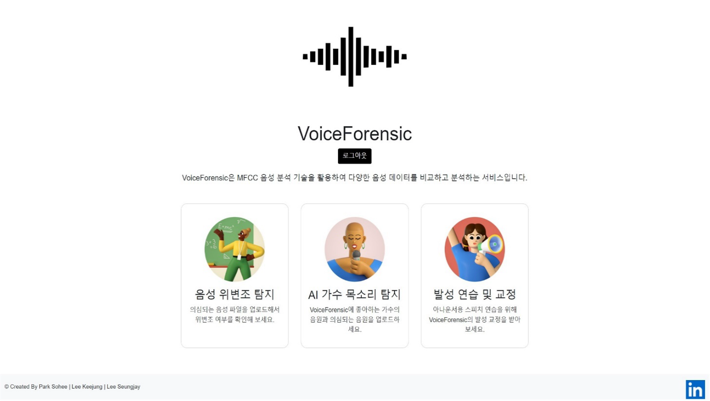
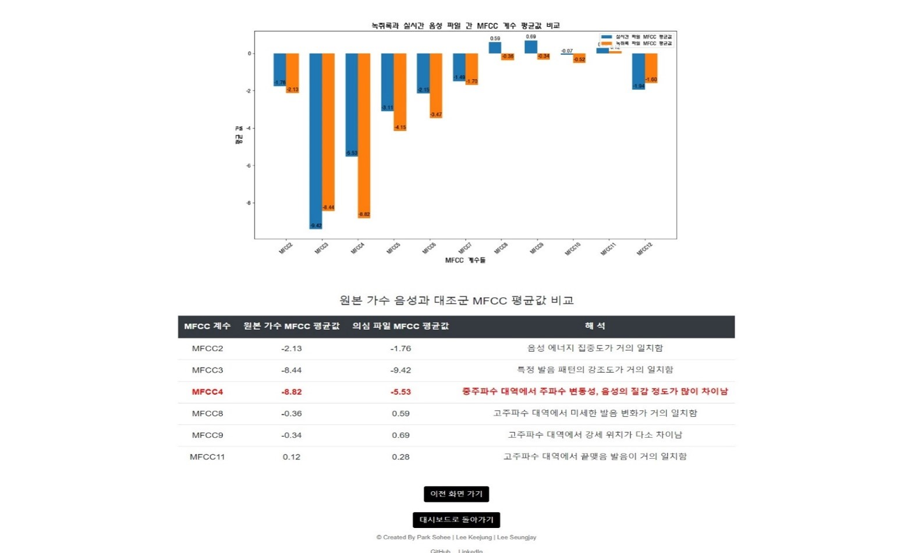

 # 음성 위변조 탐지 포렌식 🎙️
### AI 합성 음성 탐지 및 발음 교정 플랫폼, 음성 위변조 탐지 포렌식
VoiceForensics: A Platform for Detecting AI-synthesized Voices and Providing Pronunciation Correction

<div style="display: flex; gap: 10px;">
  
  
</div>
시연 URL: https://www.youtube.com/watch?v=0ooLWTzr20A

<br><br>

## 팀 정보 🧑‍🤝‍🧑
<table align="center">
    <tr align="center">
        <td><a href="https://github.com/smilehee18">
            <br/>
            <sub><b>박소희</b></sub></a>
            <br/> AI, Frontend
        </td>
        <td><a href="https://github.com/modelable">
            <br/>
            <sub><b>이기정</b></sub></a>
            <br/> Backend, Frontend
        </td>
        <td><a href="https://github.com/sjlee9908">
            <br/>
            <sub><b>이승재</b></sub></a>
            <br/> Backend, Frontend
        </td>
        <td><a href="https://github.com/idontknowherid33">
            <br/>
            <sub><b>신서형</b></sub></a>
            <br/> AI
        </td>
    </tr>
</table>

<br>

## 주요 기술 🛠️

### 시스템 아키텍쳐
<image src="https://github.com/modelable/VoiceForensics/assets/123307856/e914b85d-cf16-4253-8b0a-22887c71a211" width="800" height="400"></image>

<br>

### Tool 
```
- 개발 환경 : Windows, Mac OS
- 개발 도구 : Visual Studio Code, MongoDB Atlas
- 개발 언어 : Python, JavaScript
- 주요 기술: TensorFlow, Flask, node-MFCC, Node.js, Express.js
```

### 주요 라우트 설명

| 경로                       | 설명                                    | 렌더링 / 응답                       |
|----------------------------|---------------------------------------|------------------------------------|
| `/`                        | 인덱스 페이지 렌더링                    | `index.pug`                        |
| `/dashboard_forensic`       | 음성 위변조 탐지 대시보드               | `dashboard.pug`                    |
| `/dashboard_ai_singer`      | AI 가수 목소리 탐지 대시보드            | `dashboard.pug`                    |
| `/dashboard_announce`       | 발성 연습 및 교정 대시보드               | `dashboard.pug`                    |
| `/upload_forensic`          | 음성 위변조 탐지 음성 업로드             | `upload.pug`                      |
| `/upload_ai_singer`         | AI 가수 목소리 탐지 음성 업로드           | `upload.pug`                      |
| `/upload_announce`          | 발음 연습 및 교정 음성 업로드              | `upload.pug`                      |
| `/train_process`            | 업로드된 음성 기반 분석 단계 페이지         | `train_process.pug`                |
| `/upload_wait_events`       | Flask 서버와 연동 SSE 이벤트 전송          | `text/event-stream`                |
| `/result_forensic`          | 음성 위변조 탐지 결과 페이지                   | `result_forensic.pug` / `no_result.pug` |
| `/result_ai_singer`         | AI 가수 목소리 탐지 결과 페이지             | `result_ai_singer.pug` / `no_result.pug` |
| `/result_announce`          | 발음 연습 및 교정 결과 페이지                     | `result_announce.pug` / `no_result.pug` |
| `/result_visual`            | 결과 시각화 페이지           | `result_visual.pug`                |
| `/announcer_result`         | 발음 연습 및 교정 결과 페이지                 | `announcer_result.pug`             |
| `/announcer_result_detail`  | 발음 연습 및 교정 결과 상세보기 페이지             | `result_detail_announce.pug`      |
| `/announcer_improvements`   | 발음 연습 및 교정 개선연습 페이지      | `improvements_announce.pug`       |
| `/forensic_result_detail`   | 음성 위변조 탐지 결과 상세보기 페이지           | `result_detail_forensic.pug`      |
| `/result_detail_ai_singer`  | AI 가수 목소리 탐지 결과 상세보기 페이지         | `result_detail_ai_singer.pug`     |
| `/result_overall_ai_singer` | AI 가수 목소리 탐지 종합 결과 페이지              | `result_overall_ai_singer.pug`    |

<br>

### 데이터 모델링 구조

| **Collection (Schema)**      | **주요 필드**                                              | **참조 관계 (Ref)**                                  |
|------------------------------|-----------------------------------------------------------|-------------------------------------------------------|
| `User`                       | name, email, password, date                               | `files_record_id` → `FileRecord`  <br>`files_control_id` → `FileControl` |
| `FileRecord`                 | filename, path, date                                      | -                                                     |
| `FileControl`                | filename, path, flag, date                                | -                                                     |
| `CoeffieRecord`              | MFCID, MFCC1~12, date                                     | `files_record_id` → `FileRecord`                     |
| `CoeffieRecordAvg`           | MFCID, MFCC1~12, timestamp                                | `files_record_id` → `FileRecord`                     |
| `CoeffieControl`             | MFCID, MFCC1~12, date                                     | `files_control_id` → `FileControl`                   |
| `CoeffieControlAvg`          | MFCID, MFCC1~12, timestamp                                | `files_control_id` → `FileControl`                   |
| `Result`                     | live_data_prediction, record_data_prediction, MAE 등     | `files_record_id` → `FileRecord` <br>`files_control_id` → `FileControl` |

<br>

## 개발 기간 🗓️

2024.04.08. - 2024.09.19

<br>

## 작품 개요 ⛰️
``` 
AI 기술이 발전함에 따라 음성 변조 기술이 보다 섬세하고 정교해지고 있다.
최근 이러한 기술의 발전을 악용하여 사용자를 속여 금전을 갈취하는 보이스피싱 공격,
AI 커버곡의 무단 유포 및 저작권 침해 등의 문제가 제기되고 있다.

이를 예방하고자 딥러닝 학습 및 예측을 통해 두 음성을 비교하여 유사도를 도출하고
음성 특징 정보들을 그래프로 가시화하여 근거로 제시하는 음성 위변조 탐지 포렌식을 제안한다.

본 작품은 MFCC 기술을 통해 추출한 두 개의 음성 간 특정 주파수 대역에서의 발음 패턴, 음성의 높낮이,
에너지 분포 정도 등의 정보를 비교하여 음성의 위변조 여부를 유사도와 시각화 자료를 통해 도출한다.

첫째, 원조 가수의 목소리를 AI 합성하여 생성한 음원의 무단 배포 및 저작권 침해 예방을 위해 AI 가수의 목소리를 탐지하는 데 활용한다.
둘째, 녹취 음성 파일을 증거물로 제출하는 법정 상황과 보이스피싱 상황에서 음성의 신뢰성을 판단하는 데 활용한다.
셋째, 두 음성 간의 MFCC 계수들의 세밀한 분석을 통해 언어 교정이 필요한 아나운서의 발성 연습을 지원하는 데 활용한다.
```
<br>

## Develop Environment Configuration ✏️

### requirement module install

    npm i express pug passport passport-local bcrypt express-flash express-session mongoose dotenv puppeteer socket.io axios

### Python 환경 및 node.js 연동을 위한 필수 환경 세팅
    1. Anaconda install
    2. cd MFCC_Project/
    3. conda env create -f environment.yml 
    -> environments.yml에 프로젝트에 필요한 모듈 및 패키지들이 명시되어 있어 위 명령어로 import 가능
    4. nodemon app -> node.js 서버 실행
    5. python 설치(로컬에 설치되어 있지 않다면) 및 실행 
    + conda install -c conda-forge pyngrok pymongo librosa tensorflow

#### Python과 node.js 연동은 flask의 ngrok를 이용, 파이썬 Project와 로컬 간의 터널링을 통해 진행 (url로 접속)

### mfcc
Node.JS implementation of the MFCC (Mel Frequency Cepstrum Coefficients) algorithm.

Uses the pure Javascript implementations:

- Fast Fourier Transform, FFT-JS (https://www.npmjs.com/package/fft-js)
- Discrete Cosine Transform, DCT (https://www.npmjs.com/package/dct)

Utilizes the standard Mel Scale:

    m = 2595 log (1 + f/700)

Provides options for customizing the low and high cutoff frequency as well as specifying a custom number of Mel banks.

Note this is primarily written to be an instructional codebase, and although the mathematics is proven correct by our internal tests the code base is not optimized for production or real-time analysis.

### Introduction

Code in this project was made by following the tutorial here:

[http://practicalcryptography.com/miscellaneous/machine-learning/guide-mel-frequency-cepstral-coefficients-mfccs/](http://practicalcryptography.com/miscellaneous/machine-learning/guide-mel-frequency-cepstral-coefficients-mfccs/)

To compute the MFCC:

1. Frame samples into `N=2^X` sized buffers where `X` is an integer.
2. Pass `N` frames into the Cooley Tukey Fast Fourier Transform to produce `F=N/2` frequency bins.
3. Optionally perform a power pass `P=G(F)`.
4. Build a triangular mel-scale filter bank with `M` filters where `M` is the number of mel bands we desire.
5. For each filter `M`, apply to `P` and then add up the results, resulting in `M` mel-scale scalars (`Ms`).
6. Perform a discrete cosine transform on `Ms` and keep only the first 12 coefficients.

The 12 coefficients are the MFCC (Mel-Frequency Cepstral Coefficients).

### Concepts

The reason the term 'Cepstrum' is used is that it is a play on spectrum. In ordinary practice, we perform a spectral analysis on
time-domain data. However, in step (6) above we are performing a discrete cosine transform on information that is already in the 
frequency domain. As a result, the pseudo-spectral term cepstrum was invented.

The reason for the discrete cosine transformation step is to both compress the mel-bands and to autocorrelate them.

### Example

    var fft = require('fft-js'),
        MFCC = require('mfcc');

    // 64 Sample Signal
    var signal = [1,0,-1,0,1,0,-1,0,1,0,-1,0,1,0,-1,0,
                  1,0,-1,0,1,0,-1,0,1,0,-1,0,1,0,-1,0,
                  1,0,-1,0,1,0,-1,0,1,0,-1,0,1,0,-1,0,
                  1,0,-1,0,1,0,-1,0,1,0,-1,0,1,0,-1,0];

    // Get our 32 complex FFT Phasors
    var phasors = fft.fft(signal);

    // Get our 32 frequency magnitudes
    var mags = fft.util.fftMag(phasors);

    // Construct an MFCC with the characteristics we desire
    var mfcc = MFCC.construct(32,    // Number of expected FFT magnitudes
                              20,    // Number of Mel filter banks
                              300,   // Low frequency cutoff
                              3500,  // High frequency cutoff
                              8000); // Sample Rate (8khz)

    // Run our MFCC on the FFT magnitudes
    var coef = mfcc(mags);

    console.log(coef);

### Command Line Example

Processing the MFCC for a `.wav` file:

    node mfcc.js -w test/1khz.wav

To see all available options:

    node mfcc.js
